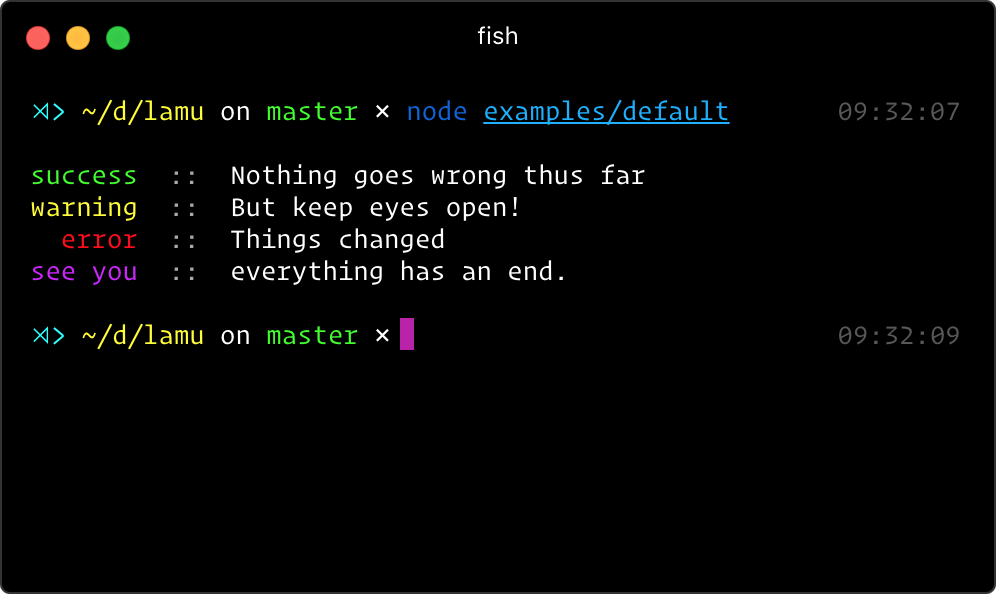
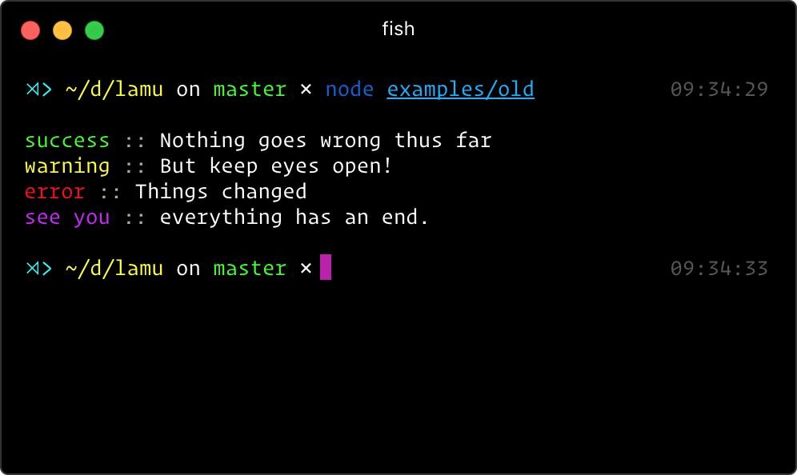
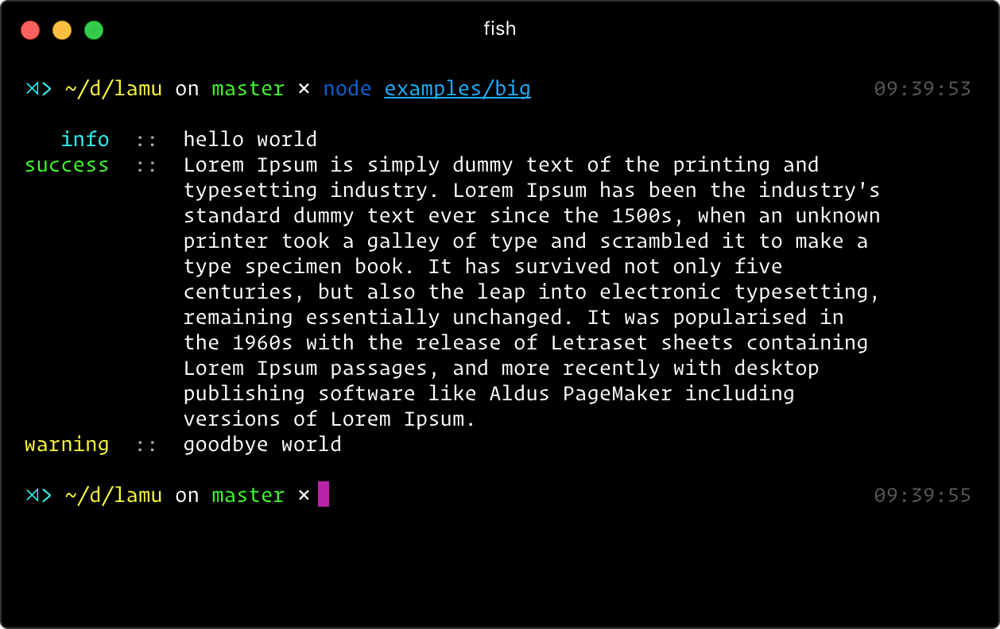
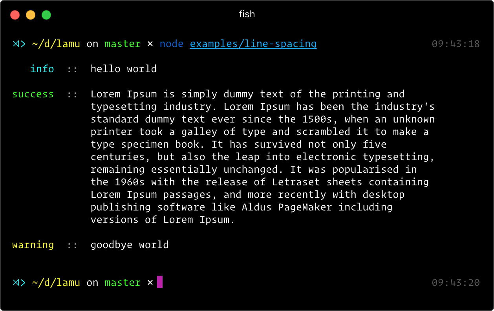
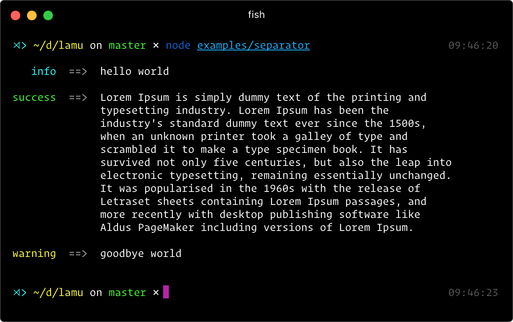

# lamu

[](https://npmjs.com/package/lamu) [](https://npmjs.com/package/lamu) [](https://circleci.com/gh/egoist/lamu)

## Install

```bash
$ npm install --save lamu
```

## Examples

### Default table layout

```js
const lamu = require('lamu')()

lamu.log({
  label: 'success',
  text: 'Nothing goes wrong thus far'
})
lamu.log({
  label: 'warning',
  text: 'But keep eyes open!'
})
lamu.log({
  label: 'error',
  text: 'Things changed'
})
lamu.log({
  label: 'see you',
  color: 'magenta',
  text: 'everything has an end.'
})

// node examples/default
```



### Old-school log layout

```js
// only the options are changed:
const lamu = require('lamu')({table: false})

// the reset is the same as default example
// node examples/old
```



### Big text friendly

```js
// big text can be correctly indented in table layout
const lamu = require('lamu')()

lamu.log({label: 'info', text: 'hello world'})
lamu.log({label: 'success', text: `Lorem Ipsum is simply dummy text of the printing and typesetting industry. Lorem Ipsum has been the industry's standard dummy text ever since the 1500s, when an unknown printer took a galley of type and scrambled it to make a type specimen book. It has survived not only five centuries, but also the leap into electronic typesetting, remaining essentially unchanged. It was popularised in the 1960s with the release of Letraset sheets containing Lorem Ipsum passages, and more recently with desktop publishing software like Aldus PageMaker including versions of Lorem Ipsum.`})
lamu.log({label: 'warning', text: 'goodbye world'})
// node examples/big
```



### Extra line-spacing

```js
// more eye-friendly
const lamu = require('lamu')({
  lineSpacing: 1
})

lamu.log({label: 'info', text: 'hello world'})
lamu.log({label: 'success', text: `Lorem Ipsum is simply dummy text of the printing and typesetting industry. Lorem Ipsum has been the industry's standard dummy text ever since the 1500s, when an unknown printer took a galley of type and scrambled it to make a type specimen book. It has survived not only five centuries, but also the leap into electronic typesetting, remaining essentially unchanged. It was popularised in the 1960s with the release of Letraset sheets containing Lorem Ipsum passages, and more recently with desktop publishing software like Aldus PageMaker including versions of Lorem Ipsum.`})
lamu.log({label: 'warning', text: 'goodbye world'})
// node examples/line-spacing
```


### Custom separator

```js
// use ==> instead of :: as separator
const lamu = require('lamu')({
  lineSpacing: 1,
  separator: '==>'
})

lamu.log({label: 'info', text: 'hello world'})
lamu.log({label: 'success', text: `Lorem Ipsum is simply dummy text of the printing and typesetting industry. Lorem Ipsum has been the industry's standard dummy text ever since the 1500s, when an unknown printer took a galley of type and scrambled it to make a type specimen book. It has survived not only five centuries, but also the leap into electronic typesetting, remaining essentially unchanged. It was popularised in the 1960s with the release of Letraset sheets containing Lorem Ipsum passages, and more recently with desktop publishing software like Aldus PageMaker including versions of Lorem Ipsum.`})
lamu.log({label: 'warning', text: 'goodbye world'})
// node examples/separator
```


## API

### Lamu({lineSpacing = 0, separator = '::'})

#### lineSpacing

Type: `number`<br>
Default: `0`

Extra line-spacing.

#### separator

Type: `string`<br>
Default: `"::"`

Use a custom separator.

### lamu.log({label, color, text})

#### label

Type: `string`

The label of the log, you can use some built-in label like `success` `error` `warning` `info` with preset colors.

#### color

Type: `string`<br>
Default: `dim`

The name of [chalk](https://github.com/chalk/chalk#styles) styles, apply to label text.

#### text

Type: `string`

The text of the log.

## Contributing

1. Fork it!
2. Create your feature branch: `git checkout -b my-new-feature`
3. Commit your changes: `git commit -am 'Add some feature'`
4. Push to the branch: `git push origin my-new-feature`
5. Submit a pull request :D

## License

[MIT](https://egoist.mit-license.org/) © [EGOIST](https://github.com/egoist)
